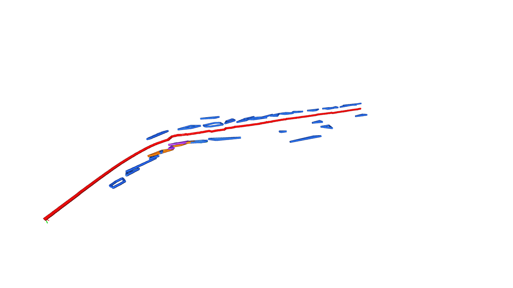

# Road Object 3D Mapping

Builds a 3D map of road objects (vehicles, pedestrians, traffic signs, etc.)
from monocular dashcam footage by combining:

- **YOLOv8** (pretrained on COCO) for 2D object detection
- **Depth Anything V2** for monocular depth estimation
- **Lucas-Kanade visual odometry** for camera pose estimation (Shi-Tomasi corners, essential-matrix decomposition, frame-to-frame scale, and a short window of bundle adjustment)
- Custom fusion logic to back-project detections into 3D and de-duplicate
  repeated sightings of the same physical object

## Example

The scene below is the pipeline output for the included dashcam clip,
[`data/1ffad8eba31588461aa76d8c8fd0be7e.mp4`](data/1ffad8eba31588461aa76d8c8fd0be7e.mp4).



The red line is the camera path. Other colors are object classes: cars are blue, motorcycles yellow, people green, trucks orange, buses purple, bicycles cyan, traffic lights lime, and stop signs magenta.

## Setup

1. Install Python dependencies:

```bash
   pip install -r requirements.txt
```

2. The sample clip is `data/1ffad8eba31588461aa76d8c8fd0be7e.mp4`, which is the path in `configs/pipeline.yaml`. To use another video, put the file under `data/` and update `paths.raw_video`.

## Usage

**Step 1 — Extract frames from your video:**

```bash
python scripts/extract_frames.py --config configs/pipeline.yaml
```

**Step 2 — Run the full pipeline** (VO poses -> detection -> depth -> 3D fusion -> visualization):

```bash
python -m src.main --config configs/pipeline.yaml
```

This will:

- Estimate camera poses for each frame via Lucas-Kanade visual odometry
- Run YOLO + depth estimation on every frame
- Project 2D detections into 3D world coordinates
- Cluster repeated sightings into distinct map objects
- Save the result to `outputs/map.ply`
- Render a scene snapshot to `outputs/scene.png`

## Configuration

All tunable parameters live in `configs/pipeline.yaml`:

- Frame extraction rate and resolution
- Camera intrinsics (optional; otherwise a default pinhole guess is used)
- Detection model + confidence threshold + target classes
- Depth model
- Clustering sensitivity (how close sightings must be to merge into one object)

## Project layout

road-object-3d-map/
├── configs/ # pipeline.yaml - all tunable parameters
├── data/
│ ├── 1ffad8eba31588461aa76d8c8fd0be7e.mp4 # sample dashcam clip
│ └── processed/ # extracted frames (generated)
├── src/
│ ├── detection/ # YOLO wrapper
│ ├── depth/ # depth model wrapper
│ ├── slam/ # Visual Odometry implementation
│ ├── mapping/ # 2D->3D projection + clustering
│ ├── visualization/ # Open3D rendering
│ └── main.py # end-to-end orchestration
├── scripts/
│ └── extract_frames.py # video -> frame images
├── tests/ # pytest unit tests
└── outputs/ # generated .ply maps + scene renders (generated)

## Known limitations / things to revisit

- Depth Anything gives **relative**, not metric, depth. Object distances in
  the map are only as accurate as the visual odometry's scale recovery — if
  you need true metric accuracy, consider adding a known reference distance
  or switching to a stereo/LiDAR setup later.
- Visual odometry can drift or fail to register frames with heavy motion
  blur, sudden turns, or low texture (e.g. featureless highway barriers).
  Scale is propagated frame to frame, and bundle adjustment only refines a
  short trailing window, so long clips still accumulate drift compared with
  a global SfM solve. Start with short, steady clips while validating the
  pipeline.
- `_parse_intrinsics` in `src/main.py` reads `PINHOLE`, `SIMPLE_PINHOLE`,
  and the focal length of `SIMPLE_RADIAL`. A radial distortion coefficient
  is ignored. Extend it if the camera uses another model.
- No fine-tuning yet: detection is 100% pretrained COCO classes. Revisit if
  you need road-specific classes (cones, potholes, custom signage).
